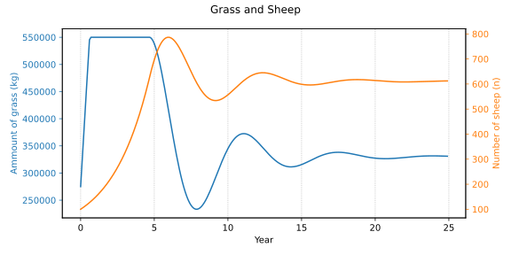

# System Dynamics

Experiments with [System Dynamics](
https://en.wikipedia.org/wiki/System_dynamics) (SD) models, mostly in
Python. The aim is to learn how to write a SD model and to modify the
[world3 model](WORLD3.md). There are several graphic tools for SD, but
I prefer writing code and generate the model graph afterwards. It's
faster and more flexible (no tool limitations). Besides, the graphic
tools are mostly commercial and can't be used on Linux (I use Ubuntu
24.04 Linux).

For Python the `system_dynamic` module from
[MyWorld3](https://github.com/Juji29/MyWorld3) is used as a
library. It is modified to be generic, and functions like plots and
model graphs are added. The model graphs are generated with
[graphviz](https://graphviz.org/).


## The grass+sheep model


Items have "tooltips" with information that should popup when you
hoover over the item. I must right-click on the graph and "Open Image
in New Tab" to get tooltips working (both in Chrome and Firefox).

The model is *greatly* simplified! For instance grass grows at a
constant rate, the number of sheep is a float, etc. It is intended for
learning only. The *real* science of plant-herbivore systems seems
[horribly complex](http://www.google.com/search?q=system+dynamics+herbivore).

Some care has been taken to get reasonable values. A sustainable
estimate is 6 sheep per ha, and we want the model to be at least in
the neighbourhood. All weights are in "dry matter". Examples:

```
Grass Limit = 5500 kg/ha
Grass Growth = 5500 kg/ha/year
Sheep Consume = 2.5 kg/day ~ 900 kg/year
```

Run it (on Linux):
```
./grass_sheep.py
# To generate the model graph:
./grass_sheep.py graph | dot -Tsvg > model.svg
```
You should see something like:



I was a bit surprised by the oscillations since that requires a
delay. But the delay is "built-in". For instance `starvation` is
computed from the *last* iteration of `grass`, so the number of sheep
can overshoot.

## NodeDelay3 and the pond model

It's not at all clear to me how `NodeDelay3` works. The "explanation" in the
[PDF](https://github.com/Juji29/MyWorld3/blob/master/MyWorld3%20Equations%20and%20Explanations.pdf)
is just the code expressed with math symbols. To investigate this, the
[pond model](pond.py) is used. It models a pond filled through a
stream and the flow is controlled by a gate. The stream is supposed to
have some length and is modelled with a delay.


The `gate` can be opened or closed and create a step or a pulse in the
flow. The `f_delayinit()` method in `NodeDelay3` takes a flow and a
constant as input. The constant influences how long the flow is
delayed, and make sure that it's well above the time-step (or weird
things happen).  The [pond model](pond.py) animates a pulse for
different delay constants. Here is a simulation for constant=2:


## JSON and post-processing

A model can partially be converted to/from a dictionary. Partially
because only nodes are handled, not equations (edges). This can for
instance be used run a model with different values without altering
the code, or to emit json data for post-processing. After a run all
data is in the `hist` arrays.

```python
import system_dynamic as sd
import json
import pond
s = sd.System(time_step=0.5, time_unit='Day')
pond.load_model(s)
s.run(end_time=8)
json.dumps(s.dict_nodes('time', 'pond'))
```

The `time` stock should always be included.

