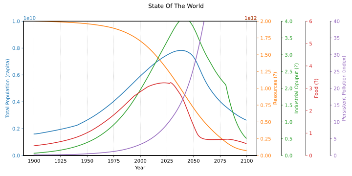
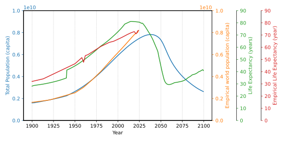

# World3

The [World3 model](https://en.wikipedia.org/wiki/World3) and the "Limit
to Growth" (LtG) book is well documented elsewhere.

I have read about [comparison with empirical data](
https://mahb.stanford.edu/wp-content/uploads/2021/07/yale-publication-1.pdf),
and [recalibration of the model](
https://onlinelibrary.wiley.com/doi/full/10.1111/jiec.13442), but
wanted to try for myself. So I tested the models referred from the
[Wiki page](https://en.wikipedia.org/wiki/World3). Here is a summary:

* [Javascript world 3 simulator](http://bit-player.org/extras/limits/) --
  Cute! Try it (takes 5sec). But interactive models can't be easily modified.
  The [description](http://bit-player.org/2012/world3-the-public-beta)
  though, is *very good reading*
* [Interactive online World3 simulation](http://insightmaker.com/insight/1954) --
  Again, hard to modify, and not public(?). But it has the best model graph
  of `world3` I have seen
* [pyworld3](https://github.com/cvanwynsberghe/pyworld3) --
  Easy to run, but the code is not object oriented. E.g. there is no `stock`
  class. This makes it hard to understand and to transform to a generic
  SD library. It also has too many dependencies
* [PyWorld3-03](https://github.com/TimSchell98/PyWorld3-03) --
  An update of the above, used for the recalibration of the model
  referred above
* `Macintosh version of the Simulation by Kenneth L. Simons` --
  Broken link, and I run Linux
* `Implementation of the World3 model` -- Broken link
* [WorldDynamics.jl](https://github.com//natema/WorldDynamics.jl) --
  Had problems to run on Linux ([issue](
  https://github.com/worlddynamics/WorldDynamics.jl/issues/210)).
  Besides, I found the load times in Julia unbearable
* [MyWorld3](https://github.com/Juji29/MyWorld3) --
  An *excellent* implementation! Easy to run and understand. Clear classes
  and basically no dependencies. Perfect for use as a SD library

I can't verify that the models are *really* implementing `world3`, but
the Python models overlay the simulation plots on top of original
scans from `LtG`, and shows an almost perfect match. That is good
enough for me.

I took the code from [MyWorld3](https://github.com/Juji29/MyWorld3)
and modified `system_dynamic.py` to be a generic SD library, and
modified `world3_model.py` to use it. Here is a BAU2 plot as an
example (run with "./world3.py"):

## Animations

I find it very interresting to alter parameters and run an animation
of plots. the `bau2_animation()` function in [world3.py](world3.py)
animates resources from 1e12 to 2e12. An interresting observation IMHO
is that the food plot before 2030 is independent of resources (and
hence also the population).

## Compare population and life expectancy to empirical data

This compares to the BAU2 estimates to empirical demographical
data. It was surprisingly hard to get consistent data, especially
before 1950. Here are the sources used:

* https://www.worldometers.info/world-population/world-population-by-year
* https://sv.wikipedia.org/wiki/V%C3%A4rldens_befolkning
* https://ourworldindata.org/life-expectancy
* https://www.statista.com/statistics/805060/life-expectancy-at-birth-worldwide

The bumps in empirical LE is caused by [China's Great Leap Forward](
https://en.wikipedia.org/wiki/Great_Leap_Forward) in 1960,
and by `Covid-19`. The leap in simulation LE is a sudden change in
"Lifetime Multiplier from Health Services" in 1940.

### Implementation

Empirical data can *easily* be defined using a table constant (CT)
([demographics.py](demographics.py)). Then a flow can be used for
plotting. Since empirical data stops at the current year (2024) the
remaining values becomes `None` and are not plotted.

### Analysis

The population in the world rises faster than in the model, and life
expectancy is much higher in the model in recent years. This indicates
that the model assumes a higher average age.

The life expectancy (LE) at 1900 is 32 years, but is 28 years in the
model (LEN). It is possible that the estimate *was* 28 years when
`world3` was created. I don't like the LE leap in the model at
1940. It seems like a "fix" to get the population plot to match up to
1970 (which it does perfectly). There is no such leap IRL.

IMHO these are serious differences, and not well addressed in the
[recalibration of the model](
https://onlinelibrary.wiley.com/doi/full/10.1111/jiec.13442).
I will try to tune the model in this area.

