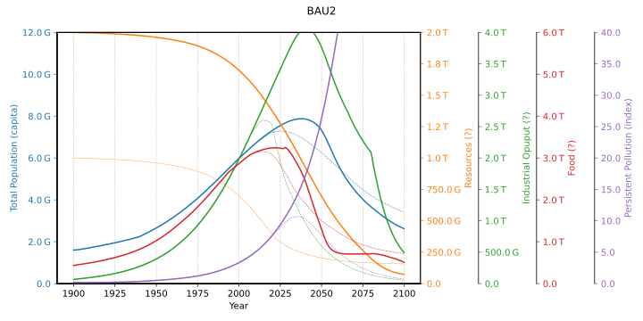
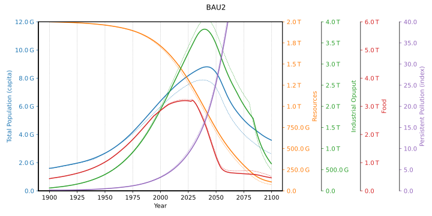
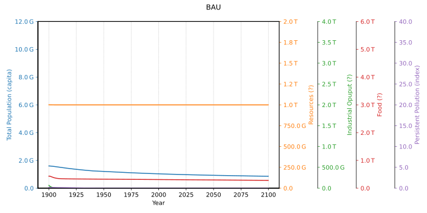

# World3

The [World3 model](https://en.wikipedia.org/wiki/World3) and the "Limit
to Growth" (LtG) book is well documented elsewhere.

I have read about [comparison with empirical data](
https://mahb.stanford.edu/wp-content/uploads/2021/07/yale-publication-1.pdf),
and [recalibration of the model](
https://onlinelibrary.wiley.com/doi/full/10.1111/jiec.13442), but
wanted to try for myself. So I tested the models referred from the
[Wiki page](https://en.wikipedia.org/wiki/World3). Here is a summary:

* [Javascript world 3 simulator](http://bit-player.org/extras/limits/) --
  Cute! Try it (takes 5sec). But interactive models can't be easily modified.
  The [description](http://bit-player.org/2012/world3-the-public-beta)
  though, is *very good reading*
* [Interactive online World3 simulation](http://insightmaker.com/insight/1954) --
  Again, hard to modify, and not public(?). But it has the best model graph
  of `world3` I have seen
* [pyworld3](https://github.com/cvanwynsberghe/pyworld3) --
  Easy to run, but the code is not object oriented. E.g. there is no `stock`
  class. This makes it hard to understand and to transform to a generic
  SD library. It also has too many dependencies
* [PyWorld3-03](https://github.com/TimSchell98/PyWorld3-03) --
  An update of the above, used for the recalibration of the model
  referred above
* `Macintosh version of the Simulation by Kenneth L. Simons` --
  Broken link, and I run Linux
* `Implementation of the World3 model` -- Broken link
* [WorldDynamics.jl](https://github.com//natema/WorldDynamics.jl) --
  Had problems to run on Linux ([issue](
  https://github.com/worlddynamics/WorldDynamics.jl/issues/210)).
  Besides, I found the load times in Julia unbearable
* [MyWorld3](https://github.com/Juji29/MyWorld3) --
  An *excellent* implementation! Easy to run and understand. Clear classes
  and basically no dependencies. Perfect for use as a SD library


I can't verify that the models are *really* implementing `world3`, but
the Python models overlay the simulation plots on top of original
scans from `LtG`, and shows an almost perfect match. That is good
enough for me.

I took the code from [MyWorld3](https://github.com/Juji29/MyWorld3)
and modified `system_dynamic.py` to be a generic SD library, and
modified `world3_model.py` to use it. Here is a BAU2 plot as an
example (run with "./world3.py"):




## Animations

I find it interresting to alter parameters and run an animation of
plots. the `bau2_animation()` function in [world3.py](world3.py)
animates resources from 1T to 2T.


## Compare population and life expectancy to empirical data


This compares to the BAU2 estimates to empirical demographical
data. It was surprisingly hard to get consistent data, especially
before 1950. Here are the sources used:

* https://www.worldometers.info/world-population/world-population-by-year
* https://sv.wikipedia.org/wiki/V%C3%A4rldens_befolkning
* https://ourworldindata.org/life-expectancy
* https://www.statista.com/statistics/805060/life-expectancy-at-birth-worldwide

The bumps in empirical LE is caused by [China's Great Leap Forward](
https://en.wikipedia.org/wiki/Great_Leap_Forward) in 1960,
and by `Covid-19`. The leap in simulation LE is a sudden change in
"Lifetime Multiplier from Health Services" in 1940.

### Implementation

Empirical data can *easily* be defined using a table constant (CT)
([demographics.py](demographics.py)). Then a flow can be used for
plotting. Since empirical data stops at the current year (2024) the
remaining values becomes `None` and are not plotted.

### Analysis

The population in the world rises faster than in the model, and life
expectancy is much higher in the model in recent years. This indicates
that the model assumes a higher average age.

The life expectancy (LE) at 1900 is 32 years, but is 28 years in the
model (LEN). It is possible that the estimate *was* 28 years when
`world3` was created. I don't like the LE leap in the model at
1940. It seems like a "fix" to get the population plot to match up to
1970 (which it does perfectly). There is no such leap IRL.

IMHO these are serious differences, and not well addressed in the
[recalibration of the model](
https://onlinelibrary.wiley.com/doi/full/10.1111/jiec.13442).
I will try to tune the model in this area.

## Population system

The population system seprarated looks like this (open the svg image
(raw) in a separate tab to see the tooltip's):


The main input variables are: Life expectancy in years (le), and
Births in children/year (b). The mortality rates for different ages
are computed from `le` with constant tables (CT), example:

```python
    M1 = s.addConstant(
        "M1", sd.CT, val=(
            [20, 0.0567],
            [30, 0.0366],
            [40, 0.0243],
            [50, 0.0155],
            [60, 0.0082],
            [70, 0.0023],
            [80, 0.001]),
        detail="Mortality rate 0-14 years", unit="f(le)")
```

For instance for le=50, the mortality rate is 0.0155 in the 0-14 year
group. These rates must be computed carefully in a way I could
maybe figure out in 1990 when I studied math, but not any more
(I am sad to say). But...

This can be tested in the model ([le.py](le.py)). The idea is to set
fixed values for Births and Life expectancy, and run the population
system model until the poulation becomes stable. For 1000 births/year
and le=70, the total population should stabilize at 70000 people.


However, it stabilizes at ~74000. Here is a plot that shows simulated
`le` compared to expected (dashed):


It differs quite much around 70-80y. Since the last value is 80 in the
model, the simulated `le` levels out.

Possible causes:

1. My reasoning is incorrect
2. The implementation of `world3` is incorrect
3. The `world3` model it incorrect

I will assume `3.` (feel free to open an issue to correct me there),
and that the rates should be tuned. By tuning the mortality rates we
can get a better match, but it doesn't seem to make much difference in
`world3`. After calling `read_M()`:


The updated mortality rates are read from [data/M.json](data/M.json).
You can modify it to test other values.


### Adjusted LE in population dynamics

By adjusting the `le` used in population dynamics by a factor 1.06 we
get a very good fit with empirical data (unmodified dashed).


The simulation `le` don't overshoot so much. This is how the adjustment
affects BAU2



Beside a better conformance with population data, the industrial
output peaks at a lower level.  The peak is around 2040. But remember,
the `world3` doesn't model political conflicts like wars.


## Recalibration of limits to growth: An update of the World3 model

To recalibrate the model was what got me started with this project.  I
read the [An update of the World3 model](
https://onlinelibrary.wiley.com/doi/full/10.1111/jiec.13442) but the
result does not seem right. The pollution in "recalibration23" is
*way* lower than BAU. If that was right we could continue to burn
fossile fuels without worries, it's only shortage of resources that is
the problem.

I was also curious on *why* some values needed so large
calibration. In the case of `alic1` (a wopping 662.15% change), the
answer is easy: it's bug. The default is not `2`, it's `14`. That
goes for both the [original DYNAMO model](
https://github.com/bfix/dynamo/blob/master/rt/world/world3-orig.dynamo)
as well as the [PyWorld3-03](
https://github.com/TimSchell98/PyWorld3-03) model used for the recalibration.
As an example here is a `BAU` run with alic1=2:




